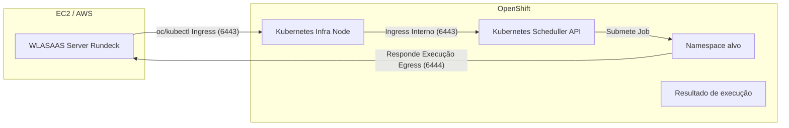

# Integração WLASaaS com OpenShift

Este README descreve arquiteturas, requisitos e passos para orquestrar workloads do OpenShift a partir do WLASaaS rodando em EC2/AWS, com foco em segurança, observabilidade e aderência a segurança.

## Arquiteturas suportadas

1. Agent dentro do OpenShift
   - Implantar Agent como Deployment no cluster.
   - Conexão de saída do Agent para o WLASAAS Server na AWS.
   - RBAC mínimo por namespace.
   - Melhor resiliência e menor latência para criar Jobs/Pods e coletar logs.

2. Agent fora do OpenShift (EC2)
   - WLASAAS chama `oc/kubectl` com kubeconfig apontando para o API on-prem (VPN).
   - Menos componentes no cluster, porém sensível à latência e dependente de conectividade estável.

## Requisitos de rede

- Conectividade privada AWS ↔ GCP ↔ Namespace (Site-to-Site VPN ou Gateway).
- Acesso ao API do OpenShift (6443/tcp) a partir da origem que executará `oc`.
- Opcional: portas do Router/Ingress (443) somente se for necessário acesso direto a serviços expostos.

## RBAC mínimo por namespace

Arquivo `rbac-wlasaas.yaml` (modelo):
```yaml
apiVersion: v1
kind: ServiceAccount
metadata:
  name: wlasaas
---
apiVersion: rbac.authorization.k8s.io/v1
kind: Role
metadata:
  name: wlasaas-namespace-role
rules:
- apiGroups: ["batch"]
  resources: ["jobs"]
  verbs: ["get","list","watch","create","delete"]
- apiGroups: [""]
  resources: ["pods","pods/log","events"]
  verbs: ["get","list","watch"]
---
apiVersion: rbac.authorization.k8s.io/v1
kind: RoleBinding
metadata:
  name: wlasaas-namespace-rb
roleRef:
  apiGroup: rbac.authorization.k8s.io
  kind: Role
  name: wlasaas-namespace-role
subjects:
- kind: ServiceAccount
  name: wlasaas
```

Aplicação:
```bash
oc -n meu-namespace apply -f rbac-controlm.yaml
```

## NetworkPolicy recomendada

Default-deny + regras explícitas para a origem do WLASaaS. Exemplo:
```yaml
apiVersion: networking.k8s.io/v1
kind: NetworkPolicy
metadata:
  name: allow-wlasaas-ingress
spec:
  podSelector:
    matchLabels:
      app: meu-app
  policyTypes: ["Ingress"]
  ingress:
  - from:
    - ipBlock:
        cidr: 10.50.60.0/24
    ports:
    - protocol: TCP
      port: 8080
    - protocol: TCP
      port: 9090
---
apiVersion: networking.k8s.io/v1
kind: NetworkPolicy
metadata:
  name: allow-egress-to-wlasaas
spec:
  podSelector: {}
  policyTypes: ["Egress"]
  egress:
  - to:
    - ipBlock:
        cidr: 10.50.60.0/24
    ports:
    - protocol: TCP
      port: 7005
    - protocol: TCP
      port: 7006
```

## Invocação de Job via WLASaaS

Script genérico chamado pelo Control-M (exemplo de parâmetros):
```bash
export KUBECONFIG=/opt/wlasaas/secrets/kubeconfig
export NAMESPACE=meu-namespace
export JOB_NAME=job-exemplo
export IMAGE=registry.access.redhat.com/ubi9/ubi-minimal
export CMD="/bin/sh -lc 'echo hello from wlasaas && sleep 2'"
./controlm_openshift_job_runner.sh
```

O script cria o Job, aguarda conclusão, captura logs e faz limpeza (TTL ou delete).

## Segurança e boas práticas

- Princípio do menor privilégio no RBAC e tokens de curta duração.
- NetworkPolicy restritiva por namespace.
- Secrets no cluster e cofre no Control-M para kubeconfig/tokens.
- TTLSecondsAfterFinished para limpeza automática de recursos.
- Auditoria e logs centralizados para trilha de mudanças e compliance.

## Diagrama (Mermaid)



## Arquivos úteis deste repositório

- `wlasaas_openshift_job_runner.sh` – criação/execução de Jobs no namespace, com captura de logs e limpeza.
- `allow-wlasaas-and-namespace-rules.sh` – regras de firewall e NetworkPolicies.
- `rbac-controlm.yaml` – ServiceAccount, Role e RoleBinding mínimos.
