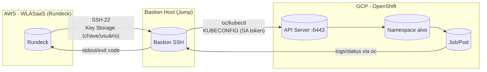
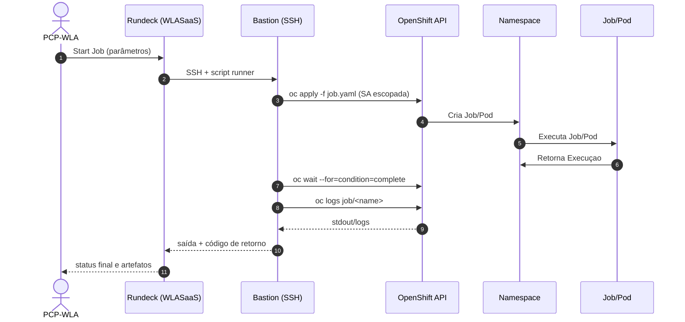
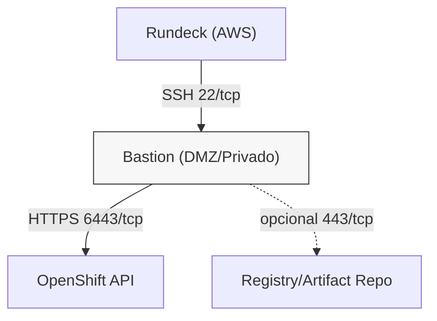

# Integração WLASaaS (Rundeck) → Bastion (SSH) → OpenShift

Arquitetura para executar Jobs do Rundeck no OpenShift usando **jump host (Bastion)** via **SSH**, com `oc/kubectl` e kubeconfig no Bastion. Objetivos: simplicidade operacional, controle de acesso por namespace e trilha de auditoria ponta a ponta.

## 1) Arquitetura (Mermaid)



**Notas rápidas**
- Nenhuma exposição pública do API do OpenShift ao WLASaaS; somente o **Bastion** acessa o **:6443**.
- O **kubeconfig + SA** ficam **apenas** no Bastion (rotação periódica).
- Execução confinada ao **namespace** por **RBAC mínimo**.

## 2) Fluxo de Execução (Sequência)



## 3) Caminho de Rede e Portas



- **Obrigatório**: SSH `22/tcp` (WLASaaS → Bastion) e **6443/tcp** (Bastion → API OpenShift).
- **Opcional**: `443/tcp` do Bastion para registries/artifacts aprovados.

## 4) Controles de Segurança (essenciais)
- **RBAC mínimo por namespace** (Role/RoleBinding) + **ServiceAccount** dedicado.
- **Kubeconfig/SA token** **somente** no Bastion; rotação via **TokenRequest**; sem credenciais no WLASaaS.
- **NetworkPolicy** restritiva no namespace (default-deny + allow para o que o Job realmente usa).
- **SCC/PSA** “restricted”; `runAsNonRoot`, `readOnlyRootFilesystem`, `capabilities: drop`.
- **Auditoria**: logs do Rundeck + `oc` + Audit do K8s enviados ao SIEM.
- **TTLSecondsAfterFinished** nos Jobs e limpeza automática de recursos.

## 5) Execução (exemplo de comando remoto)

> Chamado pelo Rundeck via SSH no Bastion.

```bash
# no Bastion (executado via SSH pelo Rundeck)
set -euo pipefail
export KUBECONFIG=/etc/kubernetes/kubeconfig-wlasaas
NS="${NS:-meu-namespace}"
JOB_NAME="${JOB_NAME:-job-exemplo}"

cat <<'YAML' | oc -n "$NS" apply -f -
apiVersion: batch/v1
kind: Job
metadata:
  name: '"$JOB_NAME"'
spec:
  ttlSecondsAfterFinished: 300
  template:
    spec:
      serviceAccountName: wlasaas
      restartPolicy: Never
      containers:
      - name: runner
        image: registry.access.redhat.com/ubi9/ubi-minimal
        command: ["/bin/sh","-lc"]
        args: ["echo hello from wlasaas; sleep 2"]
        securityContext:
          runAsNonRoot: true
          allowPrivilegeEscalation: false
YAML

oc -n "$NS" wait --for=condition=complete "job/$JOB_NAME" --timeout=15m
oc -n "$NS" logs "job/$JOB_NAME"
```

## 6) RBAC mínimo (namespace)

```yaml
apiVersion: v1
kind: ServiceAccount
metadata:
  name: wlasaas
---
apiVersion: rbac.authorization.k8s.io/v1
kind: Role
metadata:
  name: wlasaas-namespace-role
rules:
- apiGroups: ["batch"]
  resources: ["jobs"]
  verbs: ["get","list","watch","create","delete"]
- apiGroups: [""]
  resources: ["pods","pods/log","events"]
  verbs: ["get","list","watch"]
---
apiVersion: rbac.authorization.k8s.io/v1
kind: RoleBinding
metadata:
  name: wlasaas-namespace-rb
roleRef:
  apiGroup: rbac.authorization.k8s.io
  kind: Role
  name: wlasaas-namespace-role
subjects:
- kind: ServiceAccount
  name: wlasaas
```

## 7) Rundeck – Recursos do Projeto (Bastion)

Crie/atualize o arquivo `resources.yaml` do projeto:

```yaml
bastion:
  hostname: bastion.interna.seu.dominio
  nodename: bastion
  username: ec2-user
  ssh-key-storage-path: keys/bastion_id_rsa
  osFamily: unix
  tags: bastion,ssh
```

> Ajuste `hostname`, `username` e o caminho da chave no **Key Storage**.

## 8) Rundeck – Template de Job (import)

Arquivo `rundeck_job.yaml` (para **Import Jobs** no Rundeck):

```yaml
- project: SeuProjeto
  name: Run-OpenShift-Job-via-Bastion
  description: Executa um Job no OpenShift via Bastion (SSH + oc)
  loglevel: INFO
  nodeFilterEditable: false
  sequence:
    keepgoing: false
    strategy: node-first
    commands:
      - script: |
          set -euo pipefail
          export KUBECONFIG=/etc/kubernetes/kubeconfig-wlasaas
          NS="${option.ns}"
          JOB_NAME="${option.job_name}"
          cat <<'YAML' | oc -n "$NS" apply -f -
          apiVersion: batch/v1
          kind: Job
          metadata:
            name: '"${option.job_name}"'
          spec:
            ttlSecondsAfterFinished: 300
            template:
              spec:
                serviceAccountName: wlasaas
                restartPolicy: Never
                containers:
                - name: runner
                  image: registry.access.redhat.com/ubi9/ubi-minimal
                  command: ["/bin/sh","-lc"]
                  args: ["echo hello from wlasaas; sleep 2"]
                  securityContext:
                    runAsNonRoot: true
                    allowPrivilegeEscalation: false
          YAML
          oc -n "$NS" wait --for=condition=complete "job/$JOB_NAME" --timeout=15m
          oc -n "$NS" logs "job/$JOB_NAME"
  nodefilters:
    filter: name: bastion
  options:
    - name: ns
      description: Namespace de destino no OpenShift
      required: true
      value: meu-namespace
    - name: job_name
      description: Nome do Job a ser criado/executado
      required: true
      value: job-exemplo
```

## 9) Passos de Import no Rundeck
1. **Project Settings → Edit Nodes**: cole o `resources.yaml` (ou configure o Bastion via fonte de nós).
2. **Project Settings → Jobs → Upload Definition**: importe `rundeck_job.yaml`.
3. **Key Storage**: suba a chave SSH do Bastion (ex.: `keys/bastion_id_rsa`) e referencie no `resources.yaml`.
4. Teste o job passando `ns` e `job_name`.

## 10) Checklist Rápido
- [ ] Bastion com **`oc`** e **kubeconfig (SA)** do namespace.
- [ ] **RBAC + SCC/PSA** aplicados.
- [ ] **Rede liberada**: AWS→Bastion `22/tcp`; Bastion→API `6443/tcp`.
- [ ] **Key Storage** configurado no Rundeck para o Bastion.
- [ ] Job importado e executando com logs retornando ao WLASaaS.

---

> Observação: para cargas reais, substitua a imagem/`args` do Job e mantenha `ttlSecondsAfterFinished` e a coleta de logs/exit code para visibilidade e limpeza automática.
